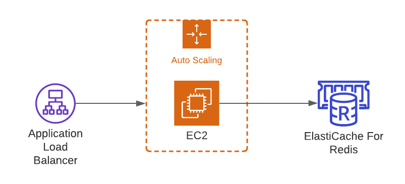

# p2piper

This repository is a source code for the application https://p2piper.com. I often need to transfer some text notes or files between devices, especially from phone to pc. Solutions like cloud storage, messenger, or native application aren't always handy. However, the WEB browser can easily handle this. That is my primary motivation for the implementation. There is no registration process for using this app.

# Architecture

The transport for file transfer is WebRTC data channels. The application itself is an isomorphic app built with `Nest.js` and `socket.io`. Backend service required for initializing connection between peers. To temporarily store the data and synchronize `socket.io` instances, Redis is used. The simplified schema below (networking, security groups, etc. non-present here, but you can refer `terraform` definition for those details):

**Note.** Two EC2 instances in autoscaling group here are mainly used for better availability. Application Load Balancer support WS protocol; that's why it's used instead of Classic one.

Deployment is organized with CodePipeline, but set up isn't a part of `terraform` definition.